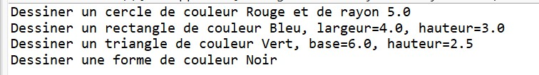
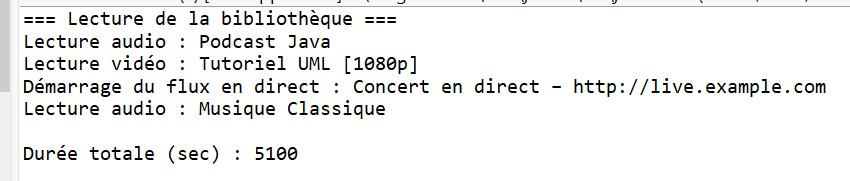
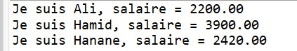

# TP Java – Exercices Polymorphisme et Héritage

## Exercice 1 : Système de dessin de formes

### Description
Ce projet montre l’utilisation du polymorphisme en Java via une super-classe `Forme` et plusieurs sous-classes (`Cercle`, `Rectangle`, `Triangle`) qui redéfinissent la méthode `dessiner()`.  
Les objets sont stockés dans un tableau unique pour illustrer la liaison dynamique (dynamic binding).

### Fonctionnalités

1. Création de formes avec couleur et dimensions
2. Parcours d’un tableau de `Forme[]`
3. Appel polymorphe de `dessiner()` pour chaque forme

### Résultats du programme

#### Dessin des formes

---

## Exercice 2 : Gestion d’une bibliothèque multimédia

### Description
Ce projet met en œuvre le polymorphisme via la hiérarchie `Media` et ses sous-classes (`Audio`, `Video`, `LiveStream`).  
Tous les médias sont stockés dans un même tableau et les méthodes `lire()` et `getDuree()` sont invoquées uniformément.

### Fonctionnalités

1. Création de médias hétérogènes
2. Lecture polymorphe via `playAll()`
3. Calcul de la durée totale avec `totalDuration()`

### Résultats du programme

#### Bibliothèque multimédia

---

## Exercice 3 : Personne, Développeur et Manager

### Description
Ce projet combine héritage, classes abstraites et génériques.  
La classe abstraite `Personne` est étendue par `Developpeur` et `Manager`.  
Une méthode générique `listerPersonnes()` applique uniformément `affiche()` à une liste d’objets polymorphes.

### Fonctionnalités

1. Calcul des salaires selon le type de personne
   - Développeur : +10%
   - Manager : +30%
2. Affichage uniforme via méthode générique pour toute liste d’objets `Personne`

### Résultats du programme

#### Salaires calculés

